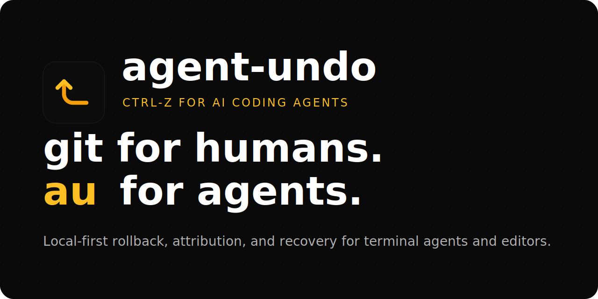

<p align="center">
  
</p>

# agent-undo (`au`)

*Local-first rollback for AI coding agents. A single binary that snapshots every file your agent writes and lets you undo any session with one command.*

*agent-undo side-steps editor checkpoints, IDE history, and after-the-fact `git reflog` recovery — all of which silently fail when the agent has been given write access to the filesystem and acted faster than your save loop.*

```sh
curl -fsSL https://agent-undo.com/install.sh | sh
```

```sh
cd my-project
au init --install-hooks
# ... agent goes wild ...
au oops
```

The crate is `agent-undo` (descriptive, panic-searchable, LLM-friendly). The binary it installs is `au` — same shape as `ripgrep` installing `rg`. You search for `agent-undo`; you type `au`.

---

## What it does

Every AI coding agent today writes to your filesystem the same way you would: directly, immediately, and irreversibly. Editor checkpoints are an in-memory afterthought. `git` is not a save loop. When the agent moves faster than your commit cadence, the only safety net is an out-of-band log of every byte that hit disk.

`au` is that log.

It runs as a small background daemon per project, snapshotting every file write into a content-addressable store (BLAKE3 hashes, zstd blobs, SQLite timeline). Every edit is attributed to the agent that made it — Claude Code, Cursor, Cline, Aider, Codex, or you — via a small hook that each of them can call. Nothing ever leaves your machine.

When something goes wrong, you type one word:

```sh
au oops
```

and the last burst of agent edits is rolled back, atomically, across every file that was touched. The rollback is itself recorded, so undo-the-undo is always one command away.

## Use cases

1. **Recover from a bad agent edit.** The hero use case. `au oops`.
2. **Audit what an agent actually changed.** `au log --agent claude-code --since 1h` and `au diff --session <id>`.
3. **Per-line agent attribution.** `au blame <file>` — like `git blame`, but tells you which agent (or human) wrote each line.
4. **Pin a known-good state before letting an agent loose.** `au pin "before refactor"` then `au unpin "before refactor"` later to restore.
5. **Wrap terminal agents without changing how you invoke them.** `au wrap install --preset codex` then `eval "$(au wrap shellenv)"`.
6. **Use built-in presets for common CLIs.** `au wrap presets`.

## Install

```sh
curl -fsSL https://agent-undo.com/install.sh | sh
```

Or from source:

```sh
cargo install agent-undo
```

Or from the latest GitHub release: macOS (arm64, x64), Linux (x64, arm64) — single ~5 MB binary, no runtime.

After install you'll have `au` on your PATH.

## Quick start

```sh
cd my-project
au init --install-hooks      # sets up .agent-undo/ and patches
                              # ~/.claude/settings.json so Claude Code
                              # edits are attributed automatically
au serve --daemon             # background watcher

# ... work normally with Claude Code / Cursor / Cline / Aider / Codex ...

au log                        # see every file event, attributed
au log --json                 # scriptable timeline output
au sessions                   # list recent agent sessions
au pin --list                 # inspect saved restore points
au oops                       # undo the last burst of agent edits
au doctor --fix               # diagnose + repair common local issues
```

For terminal-first agents without hook support:

```sh
au wrap presets
au wrap install --preset codex
eval "$(au wrap shellenv)"
codex run "..."
```

## How it works

1. **Watch.** A `notify-rs` filesystem watcher sees every write in the project tree. `.gitignore` and `.agent-undoignore` are respected.
2. **Snapshot.** Each changed file is hashed with BLAKE3 and written into a content-addressable object store under `.agent-undo/objects/`. Identical content dedupes automatically.
3. **Attribute.** Before an agent writes, its hook (`au hook pre`), session shim (`au session start`), or project-local wrapper (`au wrap install --agent ...`) drops a small active-session marker. The watcher reads that marker on each event and tags the resulting timeline entry with the agent, session id, and tool name. If no explicit session is active, `au` falls back to a best-effort local process fingerprint.
4. **Recover.** Every event lives in a SQLite timeline at `.agent-undo/timeline.db`. `restore`, `oops`, `diff`, `blame`, and `show` are all queries and inverse operations over that table. Every restore snapshots the current state first — you can never lose data by undoing.

No cloud. No account. No telemetry. One binary. One SQLite file. Your code never leaves the machine.

## Design rules

- **The agent is an untrusted process.** Treat AI coding agents the way a security engineer treats any process with write access to your filesystem.
- **Capture everything, delete nothing (until GC).**
- **Zero friction or zero adoption.** Install in one command. Works with every major AI editor out of the box.
- **Local-first, always.**
- **Never destroy data to recover data.** Every restore creates a new snapshot first.

Longer essay: [`PHILOSOPHY.md`](PHILOSOPHY.md).

## Status

`v0.0.x` — pre-alpha. The core pipeline works end-to-end. 23/23 integration tests passing. clippy `-D warnings` clean. CI green on Linux + macOS.

Coming next: first-class editor integrations, richer daemon control, and launch/distribution polish.

## License

Apache-2.0. See [`LICENSE`](LICENSE).
